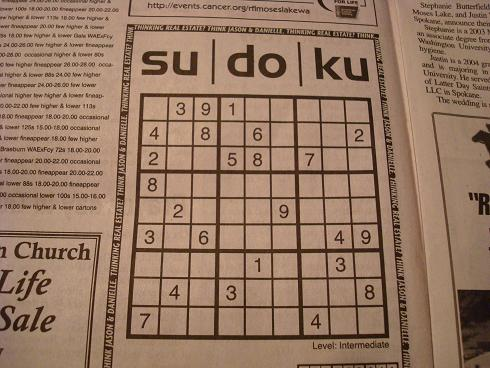
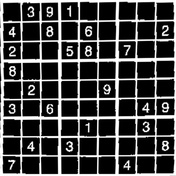
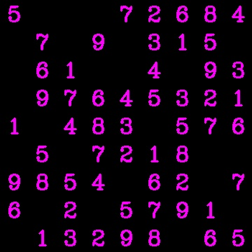
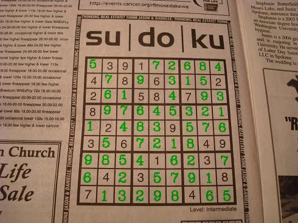

# Sudoku Solver

This tool lets you get the solution of a sudoku puzzle from its picture.

## Execution

For building the digit identification model and store them as pkl file, run:  
```
python3 build_model.py --knc_filename=<filename> --rcf_filename=<filename>
```
Once the model is built, generate the solution for a puzzle from its image using:  
```
python3 get_sudoku_solution.py --model_filename=<pkl filepath> --soduko_image=<image path>
```

## Working

Given Image <br />
</img>

1. Detection of Sudoku Bounding Box and extraction of puzzle image from original image.  
</img>
2. Image processing and detection of digits.  
</img> </img> </img> </img> </img> </img> </img> </img> </img>
3. Classifying digits based on their images using a KNN - model.
4. Solving the puzzle using backtracking.  
</img>
5. Printing solution back on image.  
</img>

Made by : Pooja Bhaagt 
